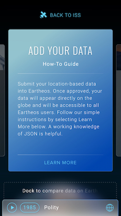
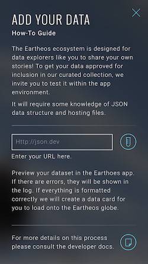
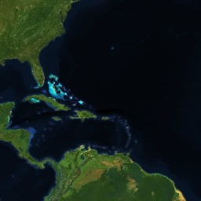
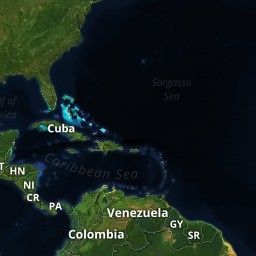
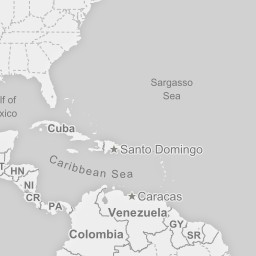
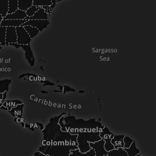
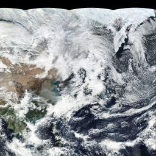
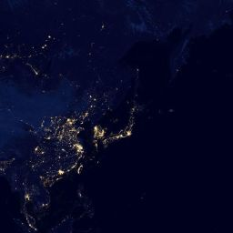
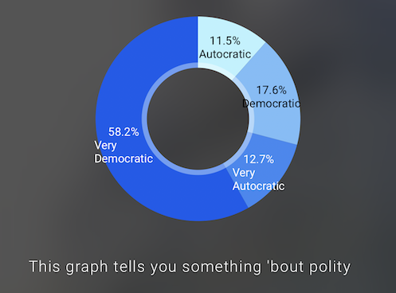

# Eartheos for Developers

Our mission is to give users perspective on global issues by transforming the Earth into a storytelling and educational platform. Developers, institutions, and students alike use the Eartheos app to visualize a topic as it relates to different locations around the world. With the globe at the center of our experience, we seek to transport users to the international space station where they can explore our planet through layers of information.

## Testing Data

### Hosting your JSON

To test the way your data renders in the Eartheos app, you can host your JSON file somewhere on the public internet (Dropbox, Amazon S3, etc) and use this URL for testing.

If you prefer, you can also set up a web server on your local machine to serve your JSON files. If you don't have one handy, we recommend the [http-server](https://github.com/indexzero/http-server) package. When doing this, ensure that you run the server from the directory in which your JSON file(s) reside. 

When entering the url into the Eartheos app, use your local area network IP address. It'll most likely look like `192.168.x.x`, `10.x.x.x`, or `172.x.x.x`.  Local addresses like `127.0.0.1` or `localhost` will not work.

### Loading the data

Once you have your data hosted (either on a server you set up or elsewhere), open Eartheos on your iOS device and scroll to the "Add Your Data" card.  Tap "Learn More" and follow the on-screen instructions.

 

## Examples

We **strongly** recommend analyzing the following collection examples for more context:

* [Polity](./examples/polity.json)
* [E-Waste](./examples/e-waste.json)

## Collection Schema

Data is delivered to the Eartheos app in [JSON](https://en.wikipedia.org/wiki/JSON) format.  Please adhere to this schema when constructing your data set to ensure the smoothest integration with Eartheos.

### Collection

A `Collection` is the Eartheos API's top-level object.  Each card on Eartheos's main view represents a collection.

```
{
	"metadata": CollectionMetadata, // required
	"style": LayerStyle,
	"layers": [Layer],
	"groups": [LayerGroup],
	"charts": [Chart],
	"key": [CategoryKeyItem | ValueKeyItem], // required
	"mapType": String
}
```

The `mapType` field is optional and defaults to `satelliteHybrid`. Alternatively, it can be set to one of the following:

| Identifier    | Description   | Preview |
| :-----------: |:-------------:| :----:  |
| `satellite` | MapBox satellite tiles |  |
| `satelliteHybrid` | MapBox satellite tiles with administrative boundaries / streets / country names / etc. | 
| `light` | MapBox map tiles with light color scheme |  |
| `dark` | MapBox map tiles with dark color scheme | 
| `correctedReflectance` | NASA "corrected reflectance" tileset |  |
| `night` | NASA "Earth at night" tileset |  |

### CollectionMetadata

```
{
	"name": String, // required
	"author": String, // required
	"category": String, // required
	"sourceURLs": [String],
	"summary": String, // required
	"description": String, // required
	"links": [String],
	"cardImage": String // required	
}
```

### CategoryKeyItem

```
{
	"color": String, // required
	"icon": String, // required
	"title": String // required
}
```

### ValueKeyItem

```
{
	"colors": [String], // required
	"minTitle": String, // required
	"maxTitle": String // required
}
```

### Chart

```
{
	"type": "string", // required
	"data": { 
		String : [Number] 
	},  // required
	"colors": [String], // required
	"summary": String
}
```

Currently, there are two supported `Chart` types:

| Type    | Notes   | Preview |
| :-----------: |:-------------:| :----:  |
| `bar` | Currently, no limit exists on the number of categories you can represent under the `data` field. Enjoy `bar` responsibly. |  |
| `pie` | Automatically calculates percentages based on the data passed. Only pass one number in each array under the `data` field. |  |

These charts appear in the "more info" section of your dataset.

### LayerGroup

```
{
	"metadata": LayerGroupMetadata,  // required
	"style": LayerStyle, 
	"layers": [Layer]  // required
}
```

### LayerGroupMetadata

```
{
	"name": String  // required
}
```

### Layer

```
{
	"metadata": LayerMetadata,  // required
	"style": LayerStyle,  // required
	"points": [LayerPoint],  // required (if polygons undefined)
	"polygons": [LayerPolygon]  // required (if points undefined)
}
```

### LayerStyle

```
{
	"color": String,  // required (if scale undefined)
	"scale": [String] // required (if color undefined)
}
```

### LayerMetadata

```
{
	"name": String, // required
	"unit": String
}
```

### LayerPoint

```
{
	"name": String, // required
	"text": String,
	"url": String,
	"value": Number,
	"key": String, // required (if lat/lon undefined)
	"lat": Number, // required (if key undefined)
	"lon": Number, // required (if key undefined)
	"style": LayerPointStyle
}
```

### LayerPointStyle

```
{
	"color": String,
	"icon": String
}
```

**Note:** values for the `icon` field in this structure come from [FontAwesome](http://fontawesome.io/icons/) and are prefixed with `fa`. For example: 

```
{ 
	"icon": "fa-cubes" 
}
```

will render [this](http://fontawesome.io/icon/cubes/) icon.

### LayerPolygon

```
{
	"name": String, // required
	"text": String,
	"url": String,
	"value": Number,
	"key": String, // required (if bounds undefined)
	"bounds": [[Float]], // required (if key undefined)
	"style": LayerPolygonStyle
}
```

### LayerPolygonStyle

```
{
	"color": String
}
```
