# Eartheos Stories for Developers

Easily create Eartheos Stories. Our mission is to give users perspective on global issues by transforming the Earth into a storytelling platform. Developers can use the Eartheos app to visualize a topic as it relates to different locations around the world. With the globe at the center of our experience, we transport users to The International Space Station as their vantage point to explore our planet from the skies above.

### Creating your JSON for Eartheos Stories

One way to easily begin creating an Eartheos Story is to use our JSON template, located here: http://eartheos.sightserve.com/collections/add This template offers the ability to save and host your JSON quickly and easily for testing later.

Once your JSON file is saved in the Eartheos cloud they can be opened in the Eartheos app. Visit the Create Your Story card in the main card carousel, tap the button at the bottom, and enter your email in the following screen. Your stories will be automatically loaded whenever you open the app. You can change to a different email or refresh your loaded stories by visiting this screen.

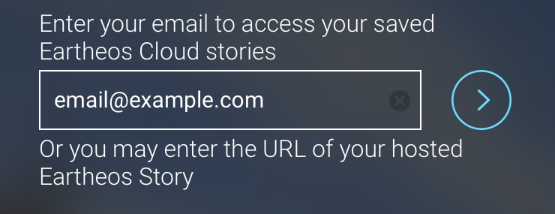

## JSON Examples

We **strongly** recommend analyzing the following collection examples below for more context. These examples currently appear within the Eartheos App as live Eartheos Stories. You can import one of these JSON examples listed below into the template we provided above to see how it is structured:

* [Polity](./examples/polity.json)
* [E-Waste](./examples/e-waste.json)
* [Lake Poopo Climate Change Timeline](./examples/stories_example.json)
* [WWII](./examples/rhino_viz_zoom.json)
* [Rhino](./examples/wwii_fallen.json)

## JSON Validation

Another helpful tool is our [JSON Schema](./eartheos_schema.json) to check for errors in your Eartheos Stories. Paste it into https://jsonschemalint.com for easy use.

### Other Hosting Options For Your JSON

Aside from hosting your JSON on the Eartheos Cloud through our Template (http://eartheos.sightserve.com/collections/add) you can host your JSON file on the public Internet (Dropbox, Amazon S3, etc) and use this hosted URL for testing.
If you are using a service like Dropbox, make sure to get a direct url to the file and not one that leads to a file viewer from that service. For example, if using Dropbox…
This URL, which leads to a Dropbox page, will not work in the Eartheos app: https://www.dropbox.com/s/00000/my_data.json 
However, using this type of direct URL to Dropbox will work in the Eartheos app: https://dl.dropbox.com/s/00000/my_data.json 

Once you have a URL to your JSON file you can enter it in the Create Your Story screen in the Eartheos app.

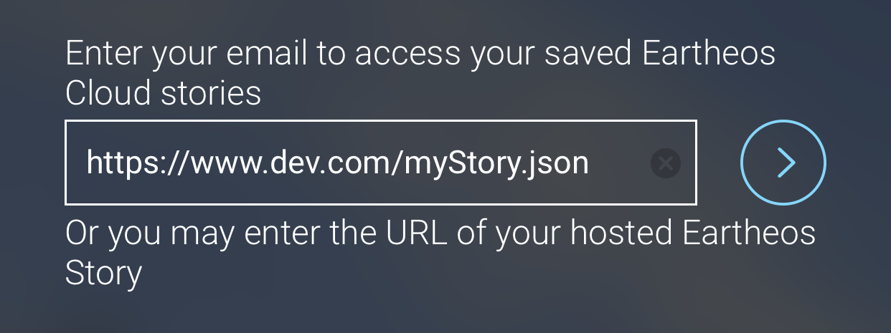

### Loading the data

Once you have your JSON built and hosted (either on Eartheos, Dropbox or elsewhere), open the Eartheos app on your iOS device, go into the Eartheos Stories carousel and scroll to the "Create Your Story" card. Tap "Create Your Story" and follow the on-screen instructions to test your JSON in the app.

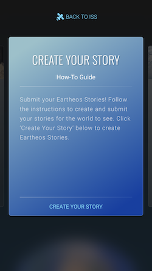 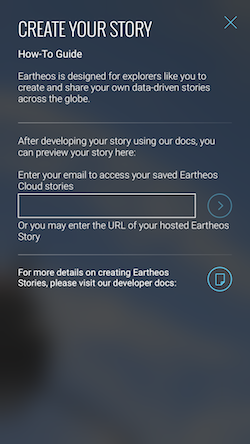

## JSON Validation

Use our [JSON Schema](./eartheos_schema.json) to check for erros in your data visualization. Paste it into https://jsonschemalint.com for easy use.


## Collection Schema

Data is delivered to the Eartheos app [JSON](https://en.wikipedia.org/wiki/JSON). Please adhere to this schema when constructing your data set to ensure the smoothest integration with Eartheos.

### Collection

A `Collection` is the Eartheos API's top-level object.  Each card on Eartheos's main view represents a collection.

The `devTools` property will turn on a couple tools to help you build an Eartheos DV. Labels for the current globe position and height will aid in determining position for your objects. When viewing a sticker on the globe, controls to adjust its position will also appear.

```
{
  	"devTools": Boolean,
  	"scaleDomain": [Number],
	"metadata": CollectionMetadata, // required
	"style": LayerStyle,
	"layers": [Layer],
	"groups": [LayerGroup],
	"charts": [Chart],
	"key": [CategoryKeyItem | ValueKeyItem], // required
	"mapType": String
}
```

###### Layers

A `Layer` included in the `layers` array of the `Collection` are always visible when the collection is on the globe, regardless of the globe's state or which `LayerGroup` is selected.

A `Layer` can contain only one type of object (`LayerPoint`, `LayerPolygon`, `LayerSticker`, `LayerLine`). Multiple types of objects can be displayed together by using multiple layers.

###### Groups

Layers included in a `LayerGroup` under a `Collection`'s array of `groups` are only visible when that specific `LayerGroup` is selected. This is particularly useful when displaying time-series data. The usual practice is to create `LayerGroup`s with their `LayerGroupMetadata` `name` attributes set to the year the enclosed `Layers` represent. After doing that, the user will be able to compare them by swiping on the picker.

###### Scale Domain

A `scaleDomain` array can be specified at the `Collection`, `LayerGroup`, or `Layer` level to set a domain for for the range of values of all the contained objects. This means that a value can be represented by the same color across all `LayerGroup` in a `Collection`. Without this property a domain will be determined by the minimum and maximum values of a `LayerGroup` or `Layer`. A `scaleDomain` should contain only two values representing the minimum and maximum of the domain.

###### Keys

The `Collection`'s `key` array allows you to define the keys/legends that appear in the cards at the bottom of the globe screen. See the `CategoryKeyItem` and `ValueKeyItem` schemas for more information.

###### Style

The `style` `Collection` allows for the definition of a default "base" layer style at the collection level. `LayerStyle`s set on individual layers will override this setting if they are specified.

###### Colors

Eartheos can handle any color values that CSS can handle. If you set a color of an object or colors in a `scale` you can use values like "hsla(0, 100%, 50%, 1.0)", "#00FF00", "rgb(0, 0, 255)", or "cyan".

###### Map Types

The `mapType` field is optional and defaults to `satelliteHybrid`. Alternatively, it can be set to one of the following:

| Identifier    | Description   | Preview |
| :-----------: |:-------------:| :----:  |
| `satellite` | Mapbox satellite tiles |  |
| `satelliteHybrid` | Mapbox satellite tiles with administrative boundaries / streets / country names / etc. | 
| `light` | Mapbox map tiles with light color scheme |  |
| `dark` | Mapbox map tiles with dark color scheme | 
| `correctedReflectance` | NASA "corrected reflectance" tileset |  |
| `night` | NASA "Earth at night" tileset |  |
| `moonlight` | Mapbox Moonlight style tiles | 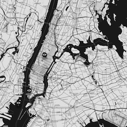 |
| `northstar` | Mapbox North Star style tiles | 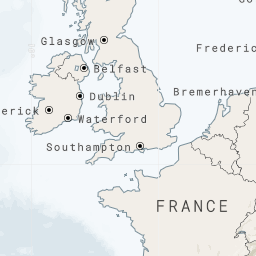 |

### CollectionMetadata

```
{
	"name": String, // required
	"author": String, // required
	"category": String, // required
	"sources": [String],
	"summary": String, // required
	"description": String, // required
	"links": [String],
	"cardImage": String // required	
}
```

### CategoryKeyItem

`CategoryKeyItem` objects are used to instruct Eartheos to render a key items. 

```
{
	"color": String, // required
	"icon": String, // required
	"title": String // required
}
```

For example, the following `CategoryKeyItem ` renders the following icon/color combination:

```
{
    "color": "#FC9723",
    "icon": "fa-amazon",
    "title": "Amazon Data Center"
}

```


### ValueKeyItem

`ValueKeyItem` objects are used to instruct Eartheos to render a key item that reflects a gradient scale of values. 

```
{
	"colors": [String], // required
	"minTitle": String, // required
	"maxTitle": String // required
}
```

For example, the following `ValueKeyItem` renders the following scale:

```
{
	"colors": [
		"#0286EF",
		"#CEF3FF"
	],
	"maxTitle": "Democratic",
	"minTitle": "Autocratic"
}
```
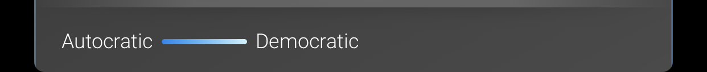


### Chart

```
{
	"type": "string", // required
	"data": { 
		String : [Number] 
	},  // required
	"colors": [String], // required
	"summary": String
}
```

Currently, there are two supported `Chart` types:

| Type    | Notes   | Preview |
| :-----------: |:-------------:| :----:  |
| `bar` | Currently, no limit exists on the number of categories you can represent under the `data` field. Enjoy `bar` responsibly. |  |
| `pie` | Automatically calculates percentages based on the data passed. Only pass one number in each array under the `data` field. |  |

These charts appear in the "more info" section of your dataset.

## Visualisations

Currently there are four supported visualisation types:

| Type    | Notes   | Preview |
| :-----------: |:-------------:| :----:  |
| `polygon` | These are regions on the map that have a `color`(red, blue, yellow). They can also be considered categorized regions. | 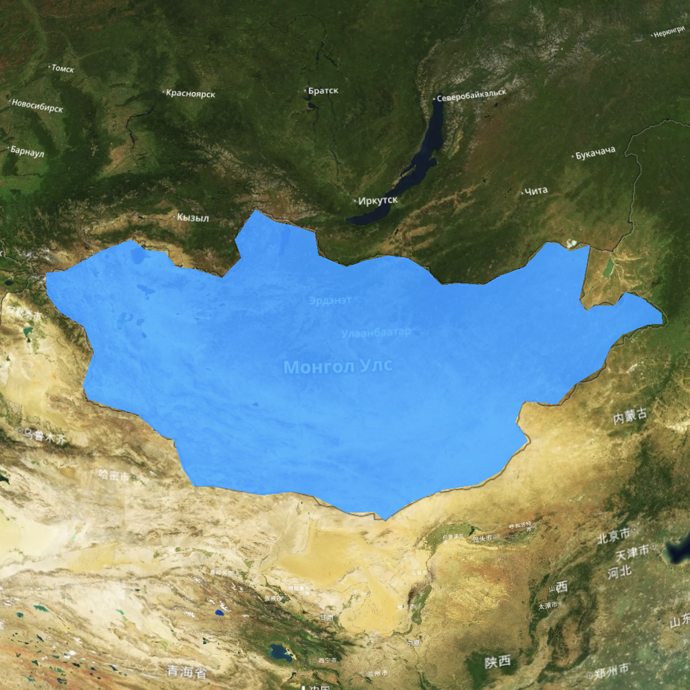 |
| `point` | These are markers on the map. Their appearance is controlled with a `color` and an `icon`. | 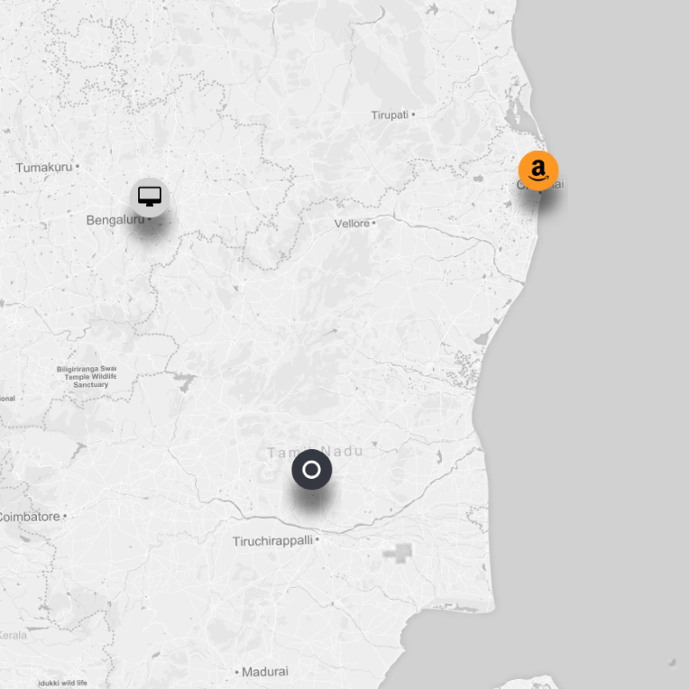 |
| `polygon + value` | This is a `region` accompanied by a `value`. The color of each region is determined by the `value` and the `scale`. | 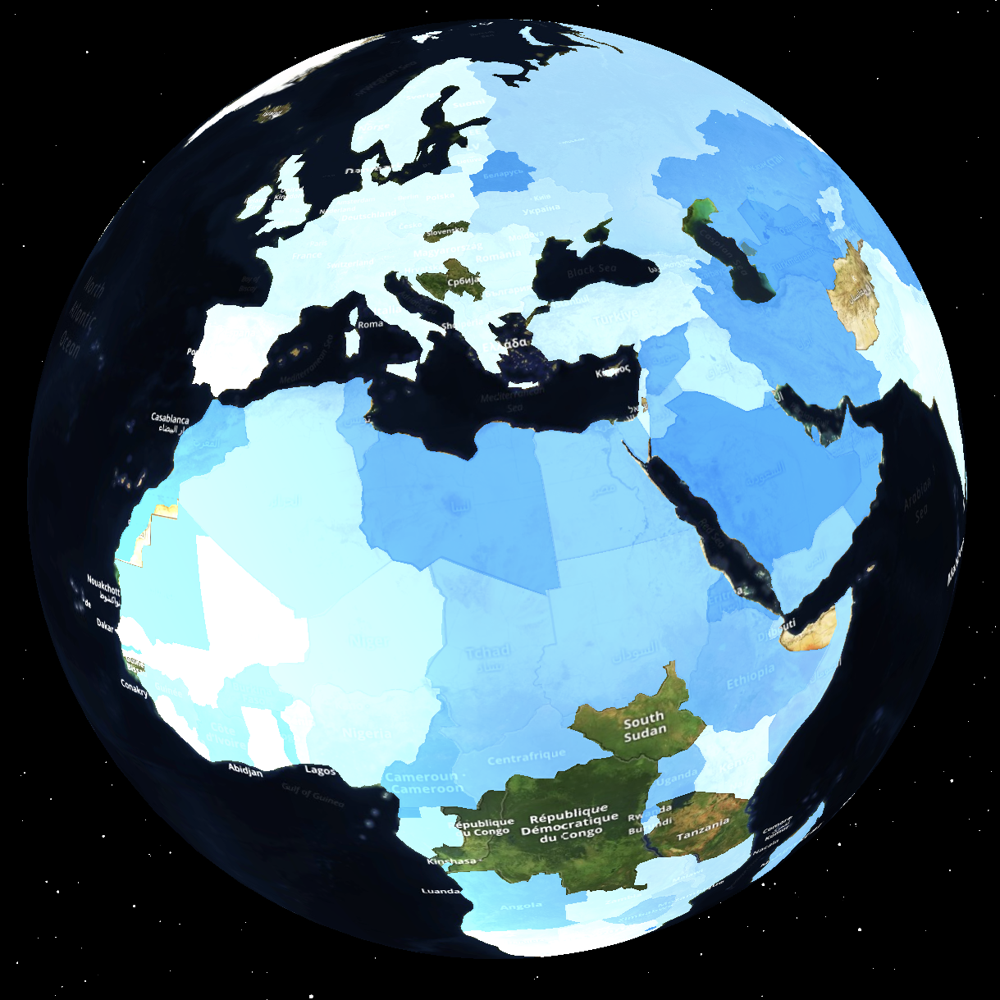 |
| `point + value` | This is a `point` accompanied by a `value`. This becomes a cylinder on the globe whose height represents its `value`. They can have any `color`. |  |

We help with the displaying of overlapping points:

| Type    | Notes   | Preview |
| :-----------: |:-------------:| :----:  |
| `overlapping points` | When two or more points are in the exact same location the markers will be offset for visibility but slightly overlapping.   | 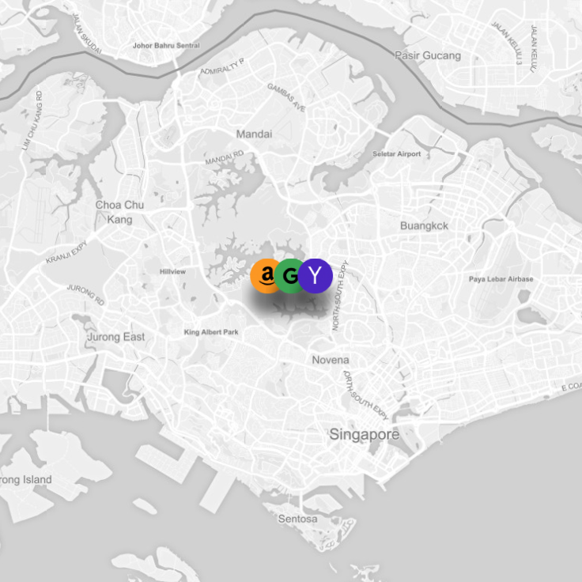 |


### LayerGroup

```
{
	"metadata": LayerGroupMetadata,  // required
	"style": LayerStyle, 
	"scaleDomain": [Number],
	"layers": [Layer]  // required
}
```

### LayerGroupMetadata

```
{
	"name": String  // required, must be unique to all LayerGroup in a Collection
}
```

### Layer

```
{
	"metadata": LayerMetadata,  // required
	"scaleDomain": [Number],
	"style": LayerStyle,  // required
	"points": [LayerPoint],  // required (if polygons and lines undefined)
	"polygons": [LayerPolygon],  // required (if points and lines undefined)
	"lines": [LayerLine], // required (if points and polygons undefined)
    "stickers": [LayerSticker]
}
```

### LayerStyle

```
{
	"color": String,  // required (if scale undefined)
	"scale": [String], // required (if color undefined)
    "icon": String
}
```

### LayerMetadata

```
{
	"name": String,
	"unit": String
}
```

### LayerPoint

```
{
	"title": String, // required
	"lead": String,
	"text": String,
	"image": String,
	"url": String,
	"audioURL": String,
	"video": String,
	"youtube": String,
	"videoStart": Number,
	"videoEnd": Number,
	"webURL": String,
	"value": Number,
	"key": String, // required (if lat/lon undefined)
	"lat": Number, // required (if key undefined)
	"lon": Number, // required (if key undefined)
	"style": LayerPointStyle,
	"camera": Camera,
	"charts": [Chart],
	"autoPlays": Bool // true by default
}
```

### LayerPointStyle

```
{
	"color": String,
	"icon": String
}
```

**Note:** values for the `icon` field in this structure come from [FontAwesome](http://fontawesome.io/icons/) and are prefixed with `fa`. For example: 

```
{ 
	"icon": "fa-cubes" 
}
```

will render [this](http://fontawesome.io/icon/cubes/) icon.

### LayerPolygon

[Check out the polygons included in Eartheos that can be used as the `key`.](./included_regions.md)

**Tip:** One way to make more distinctive polygons is to provide a `color` instead of using a `value` that maps to a color from the `scale` of a `LayerStyle`. Another way is by providing more hex colors in the `scale` of a `LayerStyle` to get a more varied gradient that will map to your values.

```
{
	"title": String, // required
	"lead": String,
	"text": String,
	"audioURL": String,
	"video": String,
	"youtube": String,
	"videoStart": Number,
	"videoEnd": Number,
	"webURL": String,
	"url": String,
	"value": Number,
	"key": String, // required (if bounds undefined)
	"bounds": [[Float]], // required (if key undefined)
	"style": LayerPolygonStyle,
	"camera": Camera,
	"charts": [Chart],
	"autoPlays": Bool // true by default
}
```

**Example:** If you would like to display a polygon that is not [included](./included_regions.md) then you can use a custom polygon as shown below.

```
{
	"title": String, // required
	"lead": String,
	"text": String,
	"video": String,
	"url": String,
	"value": Number,
	"bounds": [[68.935,-48.625],[69.58,-48.94],[70.525,-49.065],[70.56,-49.255],[70.28,-49.71],[68.745,-49.775],[68.72,-49.2425],[68.8675,-48.83],[68.935,-48.625]],
	"style": LayerPolygonStyle,
	"camera": Camera,
	"autoPlays": Bool // true by default
}
```

### LayerPolygonStyle

```
{
	"color": String
}
```

### LayerLine

```
{
	"coordinates": [LayerCoordinate], // required
	"style": LayerLineStyle
}
```

### LayerLineStyle

```
{
	"color": String
}
```


### LayerCoordinate

```
{
	"lat": Number, // required
	"lon": Number // required
}
```


### LayerSticker
A `LayerSticker` is for displaying an image on the globe. It is created with a `stickerImage` URL and coordinates to the lower-left (`ll`) and upper-right (`ur`) corners of the image.

```
{
	"stickerImage": String, // required
	"ll": { // required
        	"lat": Number,
        	"lon": Number
    },
	"ur": { // required
        	"lat": Number,
       		"lon": Number
    },
	"title": String,
	"lead": String,
	"text": String,
	"video": String,
	"videoStart": Number,
	"videoEnd": Number,
	"webURL": String,
	"url": String,
	"camera": Camera,
	"autoPlays": Bool // true by default
}
```

## Stories
Eartheos has the ability to 'play' though your data in either a default manner where the globe does not move or, with the addition of a `Camera` object, by animating around the globe.

If a `Collection` has more than one `LayerGroup`, Eartheos is able to 'play' through them by simply fading between each group. If an object, like a `LayerPolygon` or `LayerPoint`, in a `LayerGroup` has a `Camera` object then the globe will animate to the position specified during playback. Use this to highlight certain, significant points in your data or even use one point per group to play out a story.

When Eartheos arrives at a `LayerGroup` and finds a `Camera` object, the globe will animate to the specified position. If the object has information like `lead` or `text` or `image` that would be shown in an annotation, an annotation is shown.

Only one object (`LayerPolygon`, `LayerPoint`, or `LayerSticker`) in a `LayerGroup` should have a `Camera` object. Eartheos will animate to the first object with a `camera` property that it finds.

The `audioURL` property of an object allows for audio to play when the annotation for that object is displayed while the story plays. The audio will continue to play until it reaches its end, another audio file is played, a video is played, or the story is exited by the user. It is suggested that the `duration` property of `Camera` objects be aligned with what you would like displayed while the audio plays.

**Note:** If `duration` is less than 2 seconds an annotation will not be shown when arriving at that group. If `duration` is greater than 5 seconds then the globe will animate into position for 5 seconds and hold at the position until the `duration` is reached.

**Note:** Each `LayerGroup` in a `Collection` should have a unique `name`. Multiple groups with matching names will lead to unintended behavior of these groups on the globe.

**Example:** [Check out the Lake Poopó data for a stories example.](./examples/stories_example.json)

### Camera
```
{
	"height": Number, // in units of Earth's radius
	"heading": Number, // radians, 0 = North
	"tilt": Number, // radians
	"duration": Number, // seconds
	"lat": Number, // required
	"lon": Number, // required
   	"parabolic": Boolean,
    "expandKey": Boolean
}
```

### Annotations

Annotations will display and allow the user access to the `name`, `lead`, `text`, `url`, `charts`, and `image` or `video` or `youtube` of an object (`LayerPolygon` or `LayerPoint`). Annotations will appear when an object is tapped. An object should only have only either a `video`, a `youtube` or `image` as only one can be displayed. These properties should only be added to specific globe objects and not a `LayerGroup` or a `Camera`.

**`parabolic`** Set this to turn on parabolic camera movement. False by default, the camera moves directly between `Camera` locations. When on, the camera moves out from the globe and back in as the globe rotates to the next `Camera` position.

**`expandKey`** When a story is playing and a group does not have sufficient information to display an annotation, then the key will be returned to view. The key can be displayed in a fully-expanded state where all of its parts are visible. It can also be displayed in a collapsed state where only the header is visible. `expandKey` is false by default to allow for more viewing space (recommended if stickers are being viewed).

#### Media in Annotations

Annotations can hold one of the following: an image (`image`), a video (`video`) using a direct URL, a video using a YouTube video ID (`youtube`), or a web page using a URL (`webURL`). All other properties can be included together. These include `title`, `lead`, `text`, `url` (which will be linked to in a button at the bottom of the annotation), and `charts`.

**Videos:** There are two ways to include a video in an annotation. One is with a URL to a video file in the `video` property. The second way is with a YouTube video ID in the `youtube` property. These, along with the other annotation properties can be included on globe objects `LayerPolygon` or `LayerPoint`.

When playing YouTube videos, `videoStart` and `videoEnd` properties can be supplied to determine at what time (in seconds) the video starts and ends.

