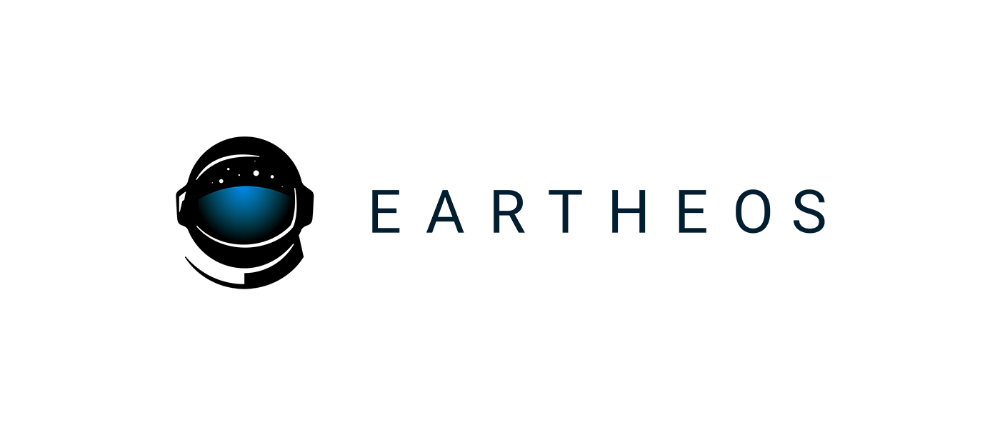
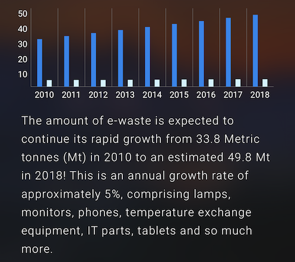

# Eartheos for Developers

Our mission is to give users perspective on global issues by transforming the Earth into a storytelling and educational platform. Developers, institutions, and students alike use the Eartheos app to visualize a topic as it relates to different locations around the world. With the globe at the center of our experience, we seek to transport users to the international space station where they can explore our planet through layers of information.

## Testing Data

### Creating your JSON

One way to start of building a data to make a visualisation is by creating a csv file in an app like Microsoft Excel or Google Sheets. These can then be converted to JSON by services like the following:

* https://konklone.io/json/
* https://shancarter.github.io/mr-data-converter/

### Hosting your JSON

##### File Hosting Services

To test the way your data renders in the Eartheos app, you can host your JSON file somewhere on the public internet (Dropbox, Amazon S3, etc) and use this URL for testing.

When using a service like Dropbox, make sure to get a direct url to the file and not one that leads to a file viewer from that service.
For example when using dropbox a url like this will lead to a Dropbox page and Eartheos will not be able to get the JSON.

`https://www.dropbox.com/s/00000/my_data.json`

However, using this url will work.

`https://dl.dropbox.com/s/00000/my_data.json`

##### Local Server

If you prefer, you can also set up a web server on your local machine to serve your JSON files. If you don't have one handy, we recommend the [http-server](https://github.com/indexzero/http-server) package. When doing this, ensure that you run the server from the directory in which your JSON file(s) reside. 

When entering the url into the Eartheos app, use your local area network IP address. It'll most likely look like `192.168.x.x`, `10.x.x.x`, or `172.x.x.x`.  Local addresses like `127.0.0.1` or `localhost` will not work.

### Loading the data

Once you have your data hosted (either on a server you set up or elsewhere), open Eartheos on your iOS device and scroll to the "Add Your Data" card.  Tap "Learn More" and follow the on-screen instructions.

 

## Examples

We **strongly** recommend analyzing the following collection examples for more context:

* [Polity](./examples/polity.json)
* [E-Waste](./examples/e-waste.json)
* [Stories](./examples/stories_example.json)
* [WWII](./examples/rhino_viz_zoom.json)
* [Rhino](./examples/wwii_fallen.json)

## Collection Schema

Data is delivered to the Eartheos app in [JSON](https://en.wikipedia.org/wiki/JSON) format.  Please adhere to this schema when constructing your data set to ensure the smoothest integration with Eartheos.

### Collection

A `Collection` is the Eartheos API's top-level object.  Each card on Eartheos's main view represents a collection.

```
{
	"metadata": CollectionMetadata, // required
	"style": LayerStyle,
	"layers": [Layer],
	"groups": [LayerGroup],
	"charts": [Chart],
	"key": [CategoryKeyItem | ValueKeyItem], // required
	"mapType": String
}
```

###### Layers

`Layer`s included in the `layers` array of the `Collection` are always visible when the collection is on the globe, regardless of the globe's state or which `LayerGroup` is selected. 

###### Groups

Layers included in a `LayerGroup` under a `Collection`'s array of `groups` are only visible when that specific `LayerGroup` is selected. This is particularly useful when displaying time-series data. The usual practice is to create `LayerGroup`s with their `LayerGroupMetadata` `name` attributes set to the year the enclosed `Layers` represent. After doing that, the user will be able to compare them by swiping on the picker.

###### Keys

The `Collection`'s `key` array allows you to define the keys/legends that appear in the cards at the bottom of the globe screen. See the `CategoryKeyItem` and `ValueKeyItem` schemas for more information.

###### Style

The `style` `Collection` allows for the definition of a default "base" layer style at the collection level. `LayerStyle`s set on individual layers will override this setting if they are specified.

###### Map Types

The `mapType` field is optional and defaults to `satelliteHybrid`. Alternatively, it can be set to one of the following:

| Identifier    | Description   | Preview |
| :-----------: |:-------------:| :----:  |
| `satellite` | MapBox satellite tiles |  |
| `satelliteHybrid` | MapBox satellite tiles with administrative boundaries / streets / country names / etc. | 
| `light` | MapBox map tiles with light color scheme |  |
| `dark` | MapBox map tiles with dark color scheme | 
| `correctedReflectance` | NASA "corrected reflectance" tileset |  |
| `night` | NASA "Earth at night" tileset |  |

### CollectionMetadata

```
{
	"name": String, // required
	"author": String, // required
	"category": String, // required
	"sources": [String],
	"summary": String, // required
	"description": String, // required
	"links": [String],
	"cardImage": String // required	
}
```

### CategoryKeyItem

`CategoryKeyItem` objects are used to instruct Eartheos to render a key items. 

```
{
	"color": String, // required
	"icon": String, // required
	"title": String // required
}
```

For example, the following `CategoryKeyItem ` renders the following icon/color combination:

```
{
    "color": "#FC9723",
    "icon": "fa-amazon",
    "title": "Amazon Data Center"
}

```


### ValueKeyItem

`ValueKeyItem` objects are used to instruct Eartheos to render a key item that reflects a gradient scale of values. 

```
{
	"colors": [String], // required
	"minTitle": String, // required
	"maxTitle": String // required
}
```

For example, the following `ValueKeyItem` renders the following scale:

```
{
	"colors": [
		"#0286EF",
		"#CEF3FF"
	],
	"maxTitle": "Democratic",
	"minTitle": "Autocratic"
}
```


### Chart

```
{
	"type": "string", // required
	"data": { 
		String : [Number] 
	},  // required
	"colors": [String], // required
	"summary": String
}
```

Currently, there are two supported `Chart` types:

| Type    | Notes   | Preview |
| :-----------: |:-------------:| :----:  |
| `bar` | Currently, no limit exists on the number of categories you can represent under the `data` field. Enjoy `bar` responsibly. |  |
| `pie` | Automatically calculates percentages based on the data passed. Only pass one number in each array under the `data` field. |  |

These charts appear in the "more info" section of your dataset.

## Visualisations

Currently there are four supported visualisation types:

| Type    | Notes   | Preview |
| :-----------: |:-------------:| :----:  |
| `region` | These are regions on the map that have a `color`(red, blue, yellow). They can also be considered categorized regions. |  |
| `point` | These are markers on the map. Their appearance is controlled with a `color` and an `icon`. |  |
| `region + value` | This is a `region` accompanied by a `value`. The color of each region is determined by the `value` and the `scale`. |  |
| `point + value` | This is a `point` accompanied by a `value`. This becomes a cylinder on the globe whose height represents its `value`. They can have any `color`. |  |

There are two ways we handle data that overlaps on the globe:

| Type    | Notes   | Preview |
| :-----------: |:-------------:| :----:  |
| `overlapping regions` | When regions from two collections overlap one will lose its color and each `region`'s `value` will instead be represented by a pattern.  |  |
| `overlapping points` | When two or more points are in the exact same location the markers will be offset for visibility but slightly overlapping.   |  |


### LayerGroup

```
{
	"metadata": LayerGroupMetadata,  // required
	"style": LayerStyle, 
	"layers": [Layer]  // required
}
```

### LayerGroupMetadata

```
{
	"name": String  // required, must be unique to all LayerGroup in a Collection
}
```

### Layer

```
{
	"metadata": LayerMetadata,  // required
	"style": LayerStyle,  // required
	"points": [LayerPoint],  // required (if polygons undefined)
	"polygons": [LayerPolygon]  // required (if points undefined)
}
```

### LayerStyle

```
{
	"color": String,  // required (if scale undefined)
	"scale": [String] // required (if color undefined)
}
```

### LayerMetadata

```
{
	"name": String,
	"unit": String
}
```

### LayerPoint

```
{
	"name": String, // required
	"lead": String,
	"text": String,
	"image": String,
	"url": String,
	"value": Number,
	"key": String, // required (if lat/lon undefined)
	"lat": Number, // required (if key undefined)
	"lon": Number, // required (if key undefined)
	"style": LayerPointStyle,
	"camera": Camera,
	"charts": [Chart]
}
```

### LayerPointStyle

```
{
	"color": String,
	"icon": String
}
```

**Note:** values for the `icon` field in this structure come from [FontAwesome](http://fontawesome.io/icons/) and are prefixed with `fa`. For example: 

```
{ 
	"icon": "fa-cubes" 
}
```

will render [this](http://fontawesome.io/icon/cubes/) icon.

### LayerPolygon

[Check out the polygons included in Eartheos that can be used as the `key`.](./included_regions.md)

**Tip:** One way to make more distinctive polygons is to provide a `color` instead of using a `value` that maps to a color from the `scale` of a `LayerStyle`. Another way is by providing more hex colors in the `scale` of a `LayerStyle` to get a more varied gradient that will map to your values.

```
{
	"name": String, // required
	"lead": String,
	"text": String,
	"video": String,
	"youtube": String,
	"url": String,
	"value": Number,
	"key": String, // required (if bounds undefined)
	"bounds": [[Float]], // required (if key undefined)
	"style": LayerPolygonStyle,
	"camera": Camera,
	"charts": [Chart]
}
```

**Example:** If you would like to display a polygon that is not [included](./included_regions.md) then you can use a custom polygon as shown below.

```
{
	"name": String, // required
	"lead": String,
	"text": String,
	"video": String,
	"url": String,
	"value": Number,
	"bounds": [[68.935,-48.625],[69.58,-48.94],[70.525,-49.065],[70.56,-49.255],[70.28,-49.71],[68.745,-49.775],[68.72,-49.2425],[68.8675,-48.83],[68.935,-48.625]],
	"style": LayerPolygonStyle,
	"camera": Camera
}
```

### LayerPolygonStyle

```
{
	"color": String
}
```

### LayerSticker
A `LayerSticker` is for displaying an image on the globe. It is created with a `stickerImage` URL and coordinates to the lower-left and upper-right corners of the image.

```
{
	"stickerImage": String, // required
	"ll": Number, // required
	"ur": Number, // required
	"name": String,
	"lead": String,
	"text": String,
	"video": String,
	"url": String,
	"camera": Camera
}
```

## Stories
Eartheos has the ability to 'play' though your data in either a default manner where the globe does not move or, with the addition of a `Camera` object, by animating around the globe.

If a `Collection` has more than one `LayerGroup`, Eartheos is able to 'play' through them by simply fading between each group. If an object, like a `LayerPolygon` or `LayerPoint`, in a `LayerGroup` has a `Camera` object then the globe will animate to the position specified during playback. Use this to highlight certain, significant points in your data or even use one point per group to play out a story.

When Eartheos arrives at a `LayerGroup` and finds a `Camera` object, the globe will animate to the specified position. If the object has information like `lead` or `text` or `image` that would be shown in an annotation, an annotation is shown.

Only one object (`LayerPolygon`, `LayerPoint`, or `LayerSticker`) in a `LayerGroup` should have a `Camera` object. Eartheos will animate to the first object with a `camera` property that it finds.

**Note:** If `duration` is less than 2 seconds an annotation will not be shown when arriving at that group. If `duration` is greater than 5 seconds then the globe will animate into position for 5 seconds and hold at the position until the `duration` is reached.

**Note:** Each `LayerGroup` in a `Collection` should have a unique `name`. Multiple groups with matching names will lead to unintended behavior of these groups on the globe.

**Example:** [Check out the Lake Poopó data for a stories example.](./examples/stories_example.json)

### Camera
```
{
	"height": Number, // in units of Earth's radius
	"heading": Number, // radians, 0 = North
	"tilt": Number, // radians
	"duration": Number, // seconds
	"latitude": Number, // required
	"longitude": Number // required
}
```

###Annotations

Annotations will display and allow the user access to the `name`, `lead`, `text`, `url`, `charts`, and `image` or `video` or `youtube` of an object (`LayerPolygon` or `LayerPoint`). Annotations will appear when an object is tapped. An object should only have only either a `video`, a `youtube` or `image` as only one can be displayed. These properties should only be added to specific globe objects and not a `LayerGroup` or a `Camera`.

**Videos:** There are two ways to include a video in an annotation. One is with a URL to a video file in the `video` property. The second way is with a YouTube video ID in the `youtube` property. These, along with the other annotation properties can be included on globe objects `LayerPolygon` or `LayerPoint`.

